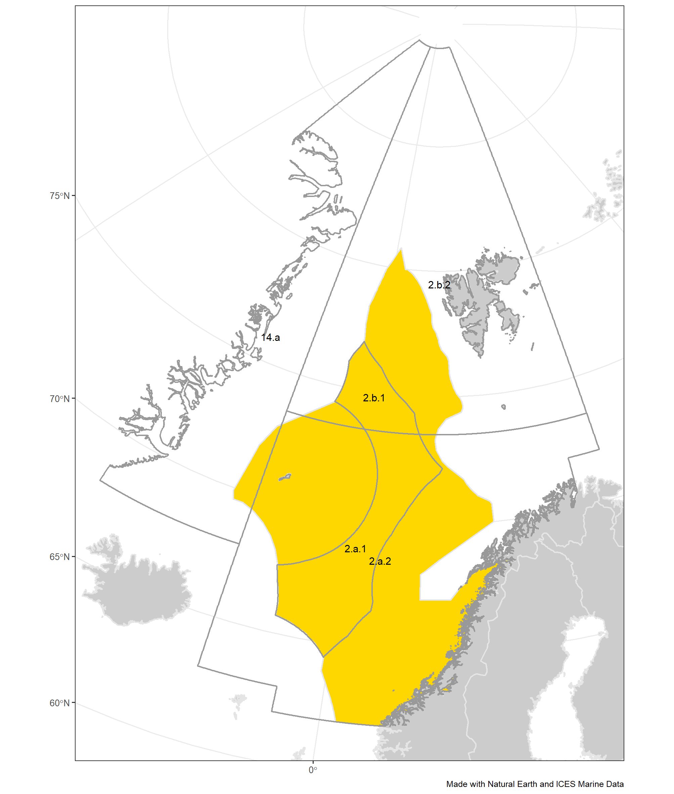

2019 Norwegian Sea Fisheries Overview
================

## List of plots in report folder:

    ## Warning in order(as.numeric(id)): NAs introduced by coercion

### 2019\_NwS\_FO\_Figure1.png

### 2019\_NwS\_FO\_Figure1.png

### 2019\_NwS\_FO\_Figure1.png

### 2019\_NwS\_FO\_Figure1.png

### 2019\_NwS\_FO\_Figure1.png

### 2019\_NwS\_FO\_Figure1.png

### 2019\_NwS\_FO\_Figure1.png

### 2019\_NwS\_FO\_Figure1.png

### 2019\_NwS\_FO\_Figure1.png

### 2019\_NwS\_FO\_Figure1.png

### 2019\_NwS\_FO\_Figure1.png

### 2019\_NwS\_FO\_Figure1.png

### 2019\_NwS\_FO\_Figure1.png

### 2019\_NwS\_FO\_Figure1.png

### 2019\_NwS\_FO\_Figure1.png

### 2019\_NwS\_FO\_Figure1.png

### 2019\_NwS\_FO\_Figure1.png

### 2019\_NwS\_FO\_Figure1.png

### 2019\_NwS\_FO\_Figure1.png

### 2019\_NwS\_FO\_Figure1.png

### 2019\_NwS\_FO\_Figure1.png

### 2019\_NwS\_FO\_Figure1.png

### 2019\_NwS\_FO\_Figure1.png

### 2019\_NwS\_FO\_Figure1.png

