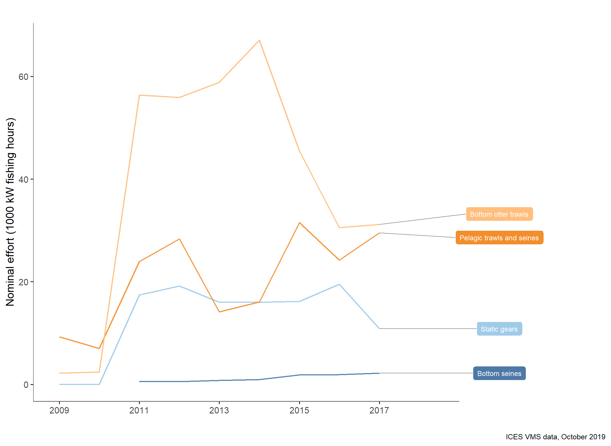
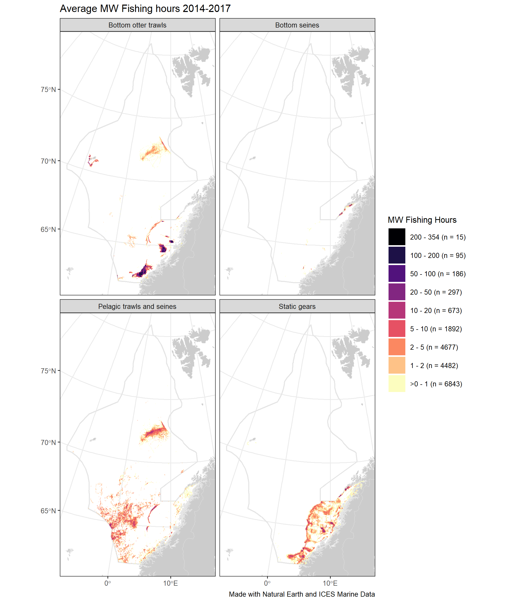
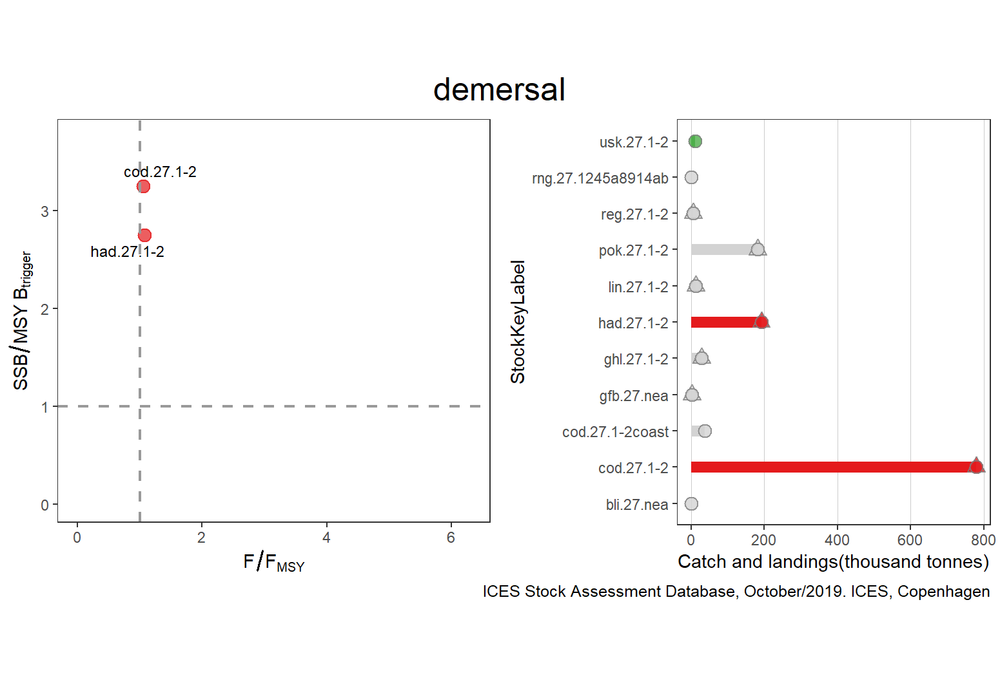
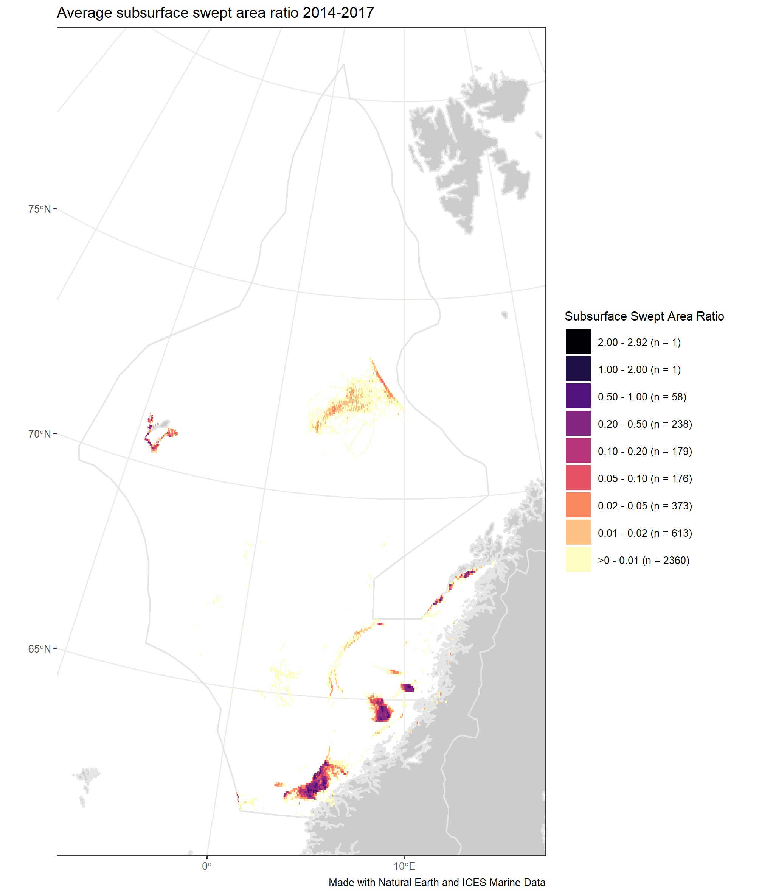

2019 Norwegian Sea Fisheries Overview
================

## List of plots in report folder:

    ## Warning in order(as.numeric(id)): NAs introduced by coercion

### FO\_Figure1

### FO\_Figure2

### FO\_Figure3

### FO\_Figure4bis

### FO\_Figure5

### FO\_Figure6

### FO\_Figure7

### FO\_Figure8

### FO\_Figure9

### FO\_Figure10

### FO\_Figure11

### FO\_Figure12b

### FO\_Figure12c

### FO\_Figure12d

### FO\_Figure12d\_from1980

### 019\_NwS\_FO\_Figure13\_All

### FO\_Figure13\_demersal

### FO\_Figure13\_pelagic

### FO\_Figure17a

### FO\_Figure17b

### EO\_GuildTrends

### EO\_GuildTrends\_noMEAN

### EO\_GuildTrends\_short

### EO\_GuildTrends\_short\_noMEAN

