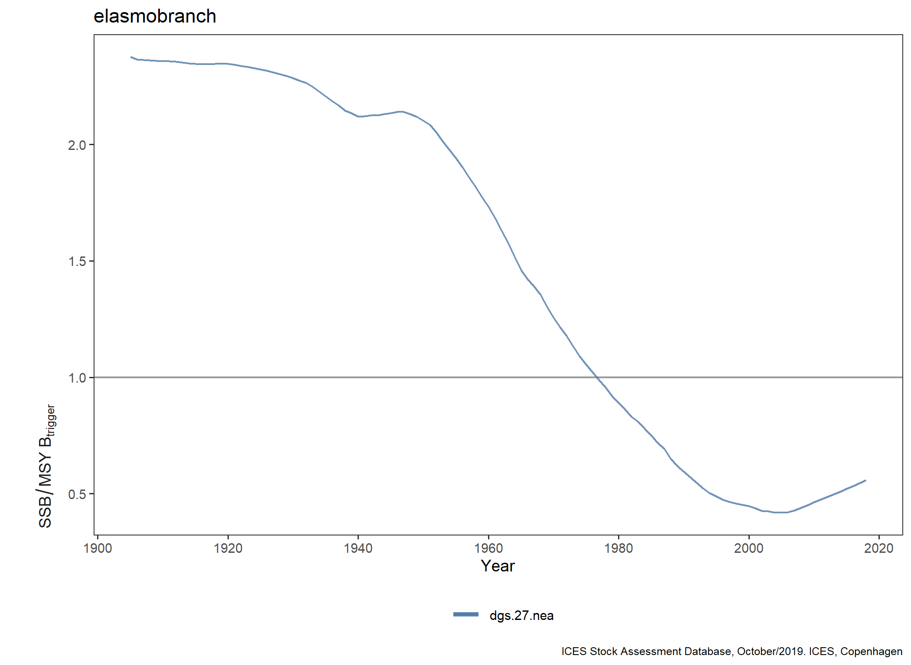
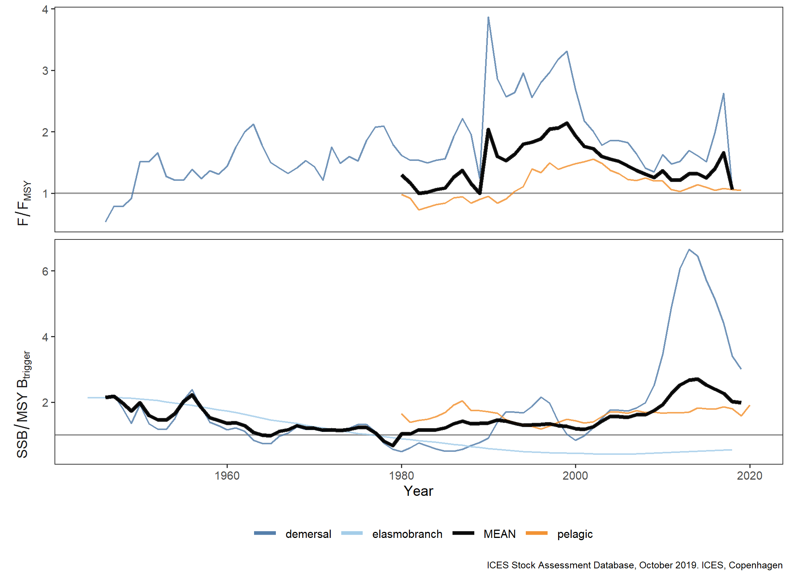

2019 Norwegian Sea Fisheries Overview
================

## List of plots in report folder:

    ## Warning in order(as.numeric(id)): NAs introduced by coercion

### 2019\_NwS\_FO\_Figure1.png

### 2019\_NwS\_FO\_Figure2.png

### 2019\_NwS\_FO\_Figure3.png

### 2019\_NwS\_FO\_Figure4bis.png

### 2019\_NwS\_FO\_Figure5.png

### 2019\_NwS\_FO\_Figure6.png

### 2019\_NwS\_FO\_Figure7.png

### 2019\_NwS\_FO\_Figure8.png

### 2019\_NwS\_FO\_Figure9.png

### 2019\_NwS\_FO\_Figure10.png

### 2019\_NwS\_FO\_Figure11.png

### 2019\_NwS\_FO\_Figure12b.png

### 2019\_NwS\_FO\_Figure12c.png

### 2019\_NwS\_FO\_Figure12d.png

### 2019\_NwS\_FO\_Figure12d\_from1980.png

### 019\_NwS\_FO\_Figure13\_All.png

### 2019\_NwS\_FO\_Figure13\_demersal.png

### 2019\_NwS\_FO\_Figure13\_pelagic.png

### 2019\_NwS\_FO\_Figure17a.png

### 2019\_NwS\_FO\_Figure17b.png

### 2019\_NwS\_EO\_GuildTrends.png

### 2019\_NwS\_EO\_GuildTrends\_noMEAN.png

### 2019\_NwS\_EO\_GuildTrends\_short.png

### 2019\_NwS\_EO\_GuildTrends\_short\_noMEAN.png

